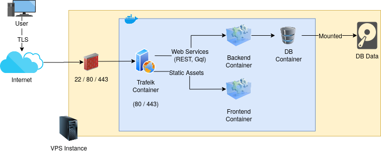

# Atix Ops 

This repository proposes a standard base setup that can be used to launch and deploy dev, staging, uat and even production environments. It might be obvious but it's worth mentioning that it will depend on the architecture of the system to be deployed and the non-functional requirements the project has (amount of concurrent users that need to be served, the amount of data that needs to be processed or stored, etc).

This is a first step towards a more complex CI/CD workflow using multiple servers with green/blue deployments capabilities (k8s based with ArgoCD maybe) and a [Beyond Corp](https://en.wikipedia.org/wiki/BeyondCorp) zero trust setup. Taking this to the next level will depend on the success of this approach and the need of a more advanced solution. You can read more about our roadmap [here](https://awesome.atixlabs.com).

The tools, scripts and configs that can be found here will help to:

- Setup a remote environment (i.e. configure a linux VPS instance with all the required runtime tools) following Atix Labs [security best practices](https://awesome.atixlabs.com).
- Deploy on a single server a set of machines using docker-compose that will connect each other to provide backend, frontend and monitoring services.

## TOC

<!-- toc -->

- [Rationale](#rationale)
- [Roadmap](#roadmap)
- [Workflow](#workflow)
- [Directory Structure](#directory-structure)
- [Gitlab CI](#gitlab-ci)
  * [Configuration - Merge and push permissions](#configuration---merge-and-push-permissions)
  * [Configuring the project](#configuring-the-project)
  * [Considerations](#considerations)
  * [Running the Jobs Locally](#running-the-jobs-locally)
- [How to include Ops scripts in your project?](#how-to-include-ops-scripts-in-your-project)
- [Remote Environment Setup](#remote-environment-setup)
  * [Prerequisites](#prerequisites)
  * [Running the setup](#running-the-setup)
  * [FAQ](#faq)
- [Deploying the Apps](#deploying-the-apps)
  * [Architecture](#architecture)
  * [Docker Compose](#docker-compose)
    + [Workflow Sample](#workflow-sample)
  * [Scripts](#scripts)
  * [FAQ](#faq-1)
- [Production](#production)
- [TO DO](#to-do)
- [Built With](#built-with)

<!-- tocstop -->

## Rationale

We must deliver top quality and reliable solutions that meets each project user needs. In order to do so we need to be able to deploy and test our work as soon as possible to gather feedback from QC and the project stakeholders.

To do so, the following requirements must be met:

- Not let anyone merge a pull request with failing tests to any stable branch (aka. master, develop).
- Be able to easily (i.e. automatically or with _just a click_) deploy to staging, UAT and production environments.
- Minimize the infrastructure (ops) work and hassle when configuring before mentioned environments.
- Easily grant (and revoke) access to our servers in order to troubleshoot any problems we might be experiencing (production, uat or staging).
- Monitor our apps system load and application related metrics.

## Roadmap

1. [x] Get rid of Jenkins for CI tasks and start using GitlabCI
    - [x] Configure new jobs to use GitlabCI.
    - [ ] Monitor if our staging environment is able to deal with GitlabCI load (maybe some tweaks are needed)
2. [x] Create our own private Docker Registry to host our images and move all the projects to a docker based deployment schema.
3. [x] Create a unified deployment schema and create repository to hold common scripts and configuration examples.
4. [ ] Replace Jenkins by [ArgoCD](https://argoproj.github.io/argo-cd/) and implement a green/blue deploy schema with QC team promotions.
5. [ ] Add a tool to easily access our servers (something like gravitational teleport)

## Workflow

The proposed workflow utilized Gitlab CI/CD features to test, package and deploy the apps. The workflow is the following:

1. People work and push their code to their own `feature/xxxx` branched. 
2. Once they create a Merge Request, code is linted and tests are checked. If any error the merge will be blocked.
3. If everything is ok and the code is merged to `develop` the code will be packaged using docker (i.e. a docker image will be created) and pushed to Atix Docker Registry.
4. If a deploy needs to be made, devs need to update a deployment configuration file specifying which images are going to be deployed.
5. Once that's done, we will use Gitlab's UI to invoke such deploys.

## Directory Structure

```
├── ansible # Directory containing common Ansible files
│   ├── gitlabci.pub # GitlabCI public key that will be used to deploy using ssh
│   ├── install-roles.sh # Script to install playbook requirements
│   ├── requirements.yml # Playbook dependencies
│   ├── setup-environment.sh # Script to invoke ansible
│   └── setup-environment.yml # Setup environment playbook
├── docker # Directory containing common Docker files
│   ├── deploy.sh # Script to deploy using docker-compose
│   ├── destroy.sh # Script to destroy a deployed environment
│   └── docker-compose-base.yml # Deployment definition
├── examples # Example project configuration files
└── $ENVIRONMENT # One for each environment i.e. staging, uat, production
    ├── ansible # Environment deployment config
    │   ├── custom-vars.json # SSH keys that will grant access to that environment over ssh
    │   ├── hosts # Environment domain name or ip
    │   └── ssh-keys # Keys that were configured in custom-vars.json
    │       ├── key1.pub
    │       └── key2.pub
    └── docker # Docker environment config
        └── .env # Environment variables to be used in docker-compose
```

_NOTE: files schemas are not described all of them have sample values that will help understanding how to configure them._

## Gitlab CI 

### Configuration - Merge and push permissions

You need to configure the following settings when creating the repository:

* Prevent merge pushes on develop and master
  - To avoid people skipping pipeline's executions.
  - Go to the project Gitlab Site, then `Settings (⚙) > Repository > Protected Branches (click on Expand)"` and configure:
    + `master`: `allowed to merge (maintainers)`, `allowed to push (maintainers)`
    + `develop`: `allowed to merge (developers + maintainers)`, `allowed to push (maintainers)`
* Ask for the pipeline to succeed before merging.
  - In order to not to break any important branch.
  - Go to the project Gitlab Site, then `Settings (⚙) > General > Merge Requests (click on Expand) > Merge checks: "Pipelines must succeed"`

### Configuring the project

In order make GitlabCI to recognize a project, you need to declare a `.gitlab-ci.yml` file in the root folder. The configuration is quite similar to the ones used by CircleCI, Travis, etc. Full spec can be found [here](https://docs.gitlab.com/ee/ci/yaml/) although there are several templates that can be foun [here](./examples/). 

- Do not forget to rename gitlab yaml files to `.gitlab-ci.yml` otherwise it won't be picked by the CI server.
- Templates provided here should be enough for 80% of the time you need to configure a project. **Reusing them is encouraged as you will share the same configuration as other projects.**
- Each project will use, in general, three different `.gitlab-ci.yml` files:
  1. The one that builds and package the frontend.
  2. The one that builds and package the backend.
  3. The one that handles the deploys.

### Considerations

* Deploys must be declared as manual jobs.
* Atix Docker Hub Credentials are stored as protected variables in Atix's Gitlab organization so you can use them to login and push the images.
* Before deploying you need to update, commit and push the Docker Compose file specifying the image versions to be deployed.
* **Don't forget to bump backend and api versions before building a new docker image or them will be replaced (that needs to be fixed).**
* Try to use already defined images to run your jobs. If you can't find the one that you are looking for, you can create your own and push it to either Docker or Atix registry (i.e. the one we built with Docker with Docker-Compose installed).
* You can access [Atix registry](https://docker.atixlabs.com) using your google credentials.

### Running the Jobs Locally

Steps can be found in this [blogpost](https://www.akitaonrails.com/2018/04/28/smalltips-running-gitlab-ci-runner-locally).

Keep in mind that:

- It might speed up your work as you don't need to push your `.gitlab-ci.yml` everything and wait for GitlabCI to pick the work
- It _seems_ you can't make cache work if you run it locally.
- It will checkout a remote commit so local code changes won't work (apparently this is made due to security reasons as your local job might deploy something by mistake. [Ref](https://gitlab.com/gitlab-org/gitlab-runner/issues/1359)).

## How to include Ops scripts in your project?

We want to be able to:

- Include changes from `atix-ops`.
- Be able to edit some files and push it to our project repositories.
- Pull changes (fixes, improvements) made in `atix-ops` to our project.

We suggest using `git subree`. As explained [here](https://stackoverflow.com/a/31770147) subtree fits best that use case:

> subtree is more like a system-based development, where your all repo contains everything at once, and you can modify any part.

A nice tutorial can be found [here](https://www.atlassian.com/git/tutorials/git-subtree) and a more detailed explanation [here](https://medium.com/@porteneuve/mastering-git-subtrees-943d29a798ec)

Steps to include ops in **your project**:

1. Move to the project directory:

```
cd myProject
```

2. Add this repository as a remote: 

```
git remote add atix-ops git@gitlab.com:atixlabs/atix-ops.git
```

3. Initialize the subtree by grabbing `atix-ops` master and pulling it into `/ops` directory

```
git subtree add --prefix ops atix-ops master --squash
```

4. A new folder named `./ops` should have been created with `atix-ops` master contents and a commit showing that. For example:

```
commit f40bf124c49bbd53ae7f5d6f1c076e21cd4b4742
Merge: d6f5b6b c8e5fce
Author: Alan Verbner
Date:   Thu Jan 30 13:44:07 2020 -0300

    Merge commit 'c8e5fcef7f2c0a9a025ac1da71984aafce1c68e8' as 'ops'
```

5. You can now update files in `./ops` directory as you need (read steps below to see which ones are you supposed to edit).

6. Push those changes to your repo as usual.

```
git add . 
git commit -m "updated ops files in order to ..."
git push origin $your_branch
```

7. If a new update has been pushed to `atix-ops` master, you can download the changes by doing:

```
git fetch atix-ops master # update the reference
git subtree pull --prefix ops aix-ops master --squash # pull the changes into our repo
```

## Remote Environment Setup

Remote environment setup is performed using an [Ansible playbook](https://docs.ansible.com/ansible/latest/user_guide/playbooks.html). [Ansible](https://www.ansible.com) is an easy to setup (as no remote hosting is required) IT infrastructure automation tool. A playbook is a way to language that can be used to describe an automation process.

This playbook relies on [Ansible Galaxy](https://galaxy.ansible.com/), a repository for common Ansible recipes (named roles).

### Prerequisites

To setup a remote environment, what you need to do is:

1. Launch the VPS instance (linux - Ubuntu or Debian stable version) and configure the `root`'s `authorized_keys` file in order to contain your public ssh key (Linode and AWS allow you to do this before launching the server). 
2. Once the server is launched, configure the following domains for each environment (staging and uat): 

  | Name                                          | Value                               | Type          |
  |-----------------------------------------------|-------------------------------------|---------------|
  | $project-$environment.atixlabs.com            | x.x.x.x                             | A Record      |
  | *.$environment.$project.atixlabs.com          | $project-environent.atixlabs.com    | CNAME Record  |

So, for example, the routing table for project `MyProject` should be:

  | Name                                          | Value                               | Type          |
  |-----------------------------------------------|-------------------------------------|---------------|
  | myproject-staging.atixlabs.com                | 173.10.33.86                        | A Record      |
  | *.staging.myproject.atixlabs.com              | myproject-staging.atixlabs.com      | CNAME Record  |
  | myproject-uat.atixlabs.com                    | 173.23.54.61                        | A Record      |
  | *.uat.myproject.atixlabs.com                  | myproject-staging.atixlabs.com      | CNAME Record  |

_Note: Production is probably a separate case as it's likely the domain won't be `atixlabs.com`. That being said, we should try to keep `api.domain.com` as the API endpoint and `domain.com` for the frontend just to be consisten with our naming. This obviously should be agreed by the Product Owner and je must make the final decision._


3. Install Ansible. See [this guide](https://docs.ansible.com/ansible/latest/installation_guide/intro_installation.html).
4. Install playbook dependencies, to do so: 
```
cd ansible && ./install-roles.sh
```
5. Update `./$ENVIRONMENT/` configs in order to set values for each environment.

### Running the setup

Running the `setup-environment.sh` script will execute the Ansible Playbook that will ssh into the server and:

- Create a user named `app`.
- Set the `authorized_keys` to the configured keys allowing them to login using ssh.
- Install `docker` and `docker-compose`
- Configure and `IPTABLES` firewall using `ufw` in order to block everything except SSH, HTTP and HTTPS traffic.  

For example, to setup staging, you will need to:

```
cd ansible && ./setup-environment.sh "staging"
```

### FAQ

**Q:** Can I install more things than the ones specified here? 

**A:** Even if you have access to the server and this scripts it's **strongly encouraged not to change this deploy process. We are aiming to have, as long as we can, all the environments configured the same way**. Rather than that create a pull request to update upstream Atix-Ops repository if you consider it might be a good addition.

***

**Q:** Can I add another ssh key after creating the environment?

**A:** Yes, just add the key and [execute the script](###Running-the-setup) again. 

***

**Q:** If database port is not being exposed when setting up the firewall, how can I access the DB? 

**A:** Just add your key to grant you access over ssh and then redirect the port to your machine. For example, if you want to get access to a postgres deployed DB you can do:

```
ssh app@my-server.com -L5432:localhost:5432
```

## Deploying the Apps

### Architecture



### Docker Compose

We use Docker Compose as a tool to run multi-container applications. We rely on it's over-ssh command execution functionality to connect to the VPS instance and execute the deployment steps.

The following containers are started:

* Backend:
  - The backend should be _dockerized_ and the image should be properly tagged and pushed to Atix's private Docker registry. 
  - It should not hold any state (i.e. user sessions)
  - If it handles file uploads, there should be a host mapped volume.
  - It must expose the port that will be used by the proxy to redirect the traffic.
  - The domain should be the one stated in [Pre-requisites Section #2](#Prerequisites)
* Frontend:
  - The frontend should be _dockerized_ and the image should be properly tagged and pushed to Atix's private Docker registry. 
  - It must expose the port that will be used by the proxy to redirect the traffic.
  - The domain should be the one stated in [Pre-requisites Section #2](#Prerequisites)
* Web Proxy:
  - Trafeik is being used as it handles auto-update Let's encrypt tls certificates and it has an excellent docker integration (each exposed port, if specified, will be auto-configured to receive traffic.)
  - All the communications should be HTTPS / TLS no matter the environment.
  - If possible, no config files should be used and everything should be configured using commandline arguments.
* DB:
  - Any DB can be used but only official images should only be configured
  - User and password should not be hard-coded.
  - The Data should be stored on a mapped volume to help backup process and allow container recreation process if required.
  - Port should be mapped to the host so the team can connect to it to do maintenance, troubleshooting or other task required. This is not unsafe as the machine is protected using `ufw` so this port will only be accessible using ssh port redirect. 
* Monitoring:
  - Cadvisor was chosen to monitor docker and resources utilization.
  - It can be accessed only using ssh port redirect.
  - **Keep in mind that this is a basic monitoring schema as it's running on the same machine as the apps (using the same resources). It might not be responsive if a problem is happening on the server (like CPU exhaustion). Other tools like DataDog should be considered for production environments.**

The following considerations should hold for all the app containers and images we create (**Again, please refer to the examples provided in this repository before creating your own version**):

1. Them must not hold any kind of state. Everything should be stored in the DB, on an external service or a docker mapped volume.
2. We should be able to destroy and restart the containers without the risk of facing data loss (see the previous item).
3. We must use the **exact same images** no matter the environment we are deploying to. **Staging and UAT images should work in production as well.** We can introduce any kind of switched and configurations (environment variables, mapped config files, etc) to be able to do so.

#### Workflow Sample

1. Work on you features as usual.
2. Once merging to `develop` branch, some checks will be ran (like unit or integration tests) on your repo and if everything is ok, a new image tagged with the version configured in the project (for example `package.json` or `pom.xml`) and the commit short-id will be pushed to Atix Docker Registry.
3. If you are ready to release a version, after merging to `release/x.y.z`, don't forget to update the versions accordingly.
4. If you are ready to deploy, update `docker-compose-base.yml` file to target the desired versions and push the changes.
5. That will allow you to execute a manual deploy. To do so, go to the `jobs` section in the Gitlab Repo and click on the ▶ button.
6. The app will be deployed to the desired environment.

For example (as a simplification `app` is used to refer to the backend and the frontend images):

1. We are working on our next version, `0.1.0`. Several commits have happened so you will see tags like `app:0.1.0-aeb11123` and `app:0.1.0-deadbeaf`
2. We are ready to release a new version so we create a branch `release/0.1.0` based off `develop`.
3. We change `develop` version to `0.2.0` (or whatever version you think is correct).
4. We update the `docker-compose-base.yml` to use `app:0.1.0-deadbeef` and deploy changes to `staging`.
5. QA has found an issue, we fix it in the branch `release/0.1.0` and push it. A new image will be created `app:0.1.0-aaaabbbb`.
6. We update the `docker-compose-base.yml` to use `0.1.0-aaaabbbb` and deploy changes to `staging`.
7. If everything is ok, we deploy the same version (`0.1.0-aaaabbbb`) to `uat`
8. If there is an issue found in `uat`, we fix it and push the changes, resulting in a new image `app:0.1.0-ccccdddd`.
9. We update `docker-compose-base.yml` to taget `app:0.1.0-ccccdddd` and deploy it to `staging`.
10. If it's ok in `staging` we deploy it to `uat`
11. If everything is ok, we merge to master and deploy to `production`.

### Scripts

All the bash scripts included in this directory are supposed to be short and self explanatory. Please read them if you want to understand how do they work. Most of the time is just defining some values using the environment type (staging, uat) as parameter.

Refer to [Directory Structure Section](#directory-structure) to find a description of the directories and scripts.

### FAQ

**Q:** Can I use the same tools to launch a local environment for development purposes? For example, I want to work on frontend related tasks without the need to install the backend framework and the db?

**A:** First of all is important to determine what backend version do you want to use. You can see all the deployed version in our [docker registry](https://docker.atixlabs.com). Let's assume we picked latest development version. The project is named `theproject` and the image `theproject-back:0.1.0-deadbeef`. What you need to do is:

1. Update `docker-compose-base.yml` in order to put the `theproject-ack:0.1.0-deadbeef` version
2. Execute:

```
$ cd ops/docker
$ ./deploy.sh "development"
$ docker inspect $theproject_backend_1 | grep IPAddress
>             "SecondaryIPAddresses": null,
            "IPAddress": "",
                    "IPAddress": "172.20.0.4",
```

Now, you will be able to query the backend by configuring your frontend to connect to `http://172.20.0.4:8080/` as a base url.

If you want to destroy the environment, just execute:

```
$ cd ops/docker
$ ./destroy "development"
```

***

**Q:** When are the builds triggered for each project? 

**A:** Builds should only be triggered when something is pushed to `develop`, `release/x.y.z` and `hotfix/xxxxx`.

## Production

In order to deploy to production the same ideas should be pursued but the following things should be considered:

* Create a separate `docker-compose` file because:
  - the DB might not be ran using a container but a third party provider or even a separate VPS instance.
  - domain will probably be custom defined.
* Enable or disable the monitoring services depending on your needs and tools to be ran in production.
* Configuration variables **MUST NEVER BE PUSHED TO ANY REPOSITORY**. As a first step we should configure them as Gitlab's variables but in the future Hashicorp's Vault will be explored.

## TO DO

The following tasks are not yet included in this process:

- Create a set of GitlabCI pipeline examples to be used as starting point
  - [x] Create React App Frontend
  - [ ] NextJs app
  - [ ] NodeJs Backend
  - [x] Maven Based Spring boot app
- Improve GitlabCi pipelines to follow the recommendations mentioned [here](https://medium.com/@ryzmen/gitlab-fast-pipelines-stages-jobs-c51c829b9aa1).
- Define a backup tool and execution steps to save in a separate server.
- Define a standard monitoring tool to be used (It doesn't need to be self-hosted by us, it can be Data Dog for example).

## Built With

* [Ansible](https://www.ansible.com/) - The automation tool.
* [Docker](https://www.docker.com) - Container Service. 
* [Docker-Compose](https://docs.docker.com/compose/) - Single machine containers orchestration.
* [Trafeik](https://containo.us/traefik/) - Reverse proxy with TLS and docker support.
* [Cadvisor](https://github.com/google/cadvisor) - Docker Monitoring tool.


